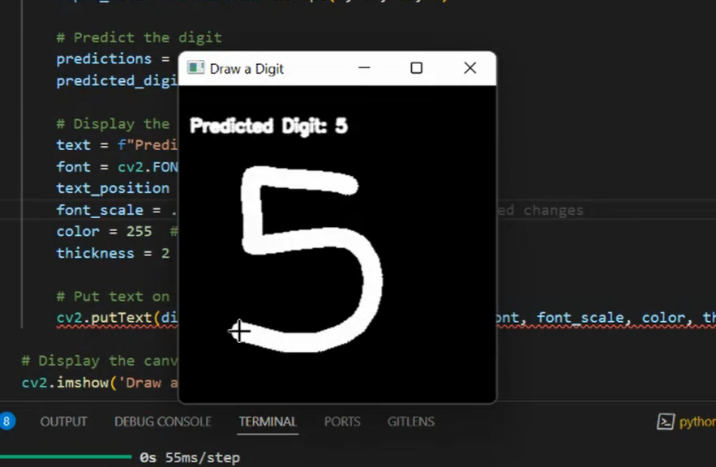

# Handwritten Digit Recognition using Deep Learning (CNN)

<video controls>
  <source src="./shots/video1.mp4" type="video/mp4">
  Your browser does not support the video tag.
</video>




Welcome to the Handwritten Digit Recognition project! This repository contains code and resources for building and deploying a convolutional neural network (CNN) that can recognize handwritten digits, both from the standard MNIST dataset and real-time camera inputs.

## 🚀 Project Overview

The goal of this project is to explore the fascinating field of computer vision by creating a model capable of recognizing handwritten digits. We extend the traditional approach by:

- **Building a Custom CNN Architecture:** Tailored for accuracy and efficiency.
- **Implementing Advanced Preprocessing Techniques:** To handle real-world data variability.
- **Developing Interactive Applications:** Allowing users to draw digits or use their webcam for live recognition.

## 🌟 Features

- **Digit Recognition from Drawings:** Draw digits on a virtual canvas and get instant predictions.
- **Real-Time Camera Recognition:** Show handwritten digits to your webcam and see the model predict in real time.
- **Interactive User Interface:** User-friendly interfaces built with OpenCV for seamless interaction.
- **Modular Codebase:** Easy-to-understand and well-documented code for learning and extension.

## 🖥️ Demo

*Showing the model predicting digits drawn on a canvas and recognizing digits from a camera feed.*

## 📂 Repository Structure

- `main.py`: Script training the CNN model.
- `test_paint.py`: Application to draw digits and get predictions.
- `test_camera.py`: Application to recognize digits from webcam input.
- `README.md`: Project documentation.

## 🛠️ Installation

### Prerequisites

- Python 3.6 or higher
- pip package manager

### Clone the Repository

```bash
git clone https://github.com/abolraj/handwritten-digits-deep-learning-cnn.git
cd handwritten-digits-deep-learning-cnn
```


## 📚 Usage

### 1. Training the Model

If you wish to train the model yourself:

```bash
python main.py
```

*This script will train the CNN model on the MNIST dataset and save the trained model as `improved_trained_model.h5`.*

### 2. Digit Recognition by Drawing

Run the application where you can draw digits:

```bash
python digit_recognition_draw.py
```

**Instructions:**

- **Draw:** Click and drag the mouse to draw a digit.
- **Predict:** Release the mouse button to see the predicted digit.
- **Clear:** Press the 'c' key to clear the canvas.
- **Exit:** Press the 'q' key to exit the application.

### 3. Real-Time Digit Recognition with Camera

Run the application that uses your webcam:

```bash
python digit_recognition_camera.py
```

**Instructions:**

- **Display Digit:** Write a digit on a piece of paper and hold it up to the webcam within the designated rectangle.
- **Prediction:** The model will predict the digit and display it on the screen.
- **Exit:** Press the 'q' key to exit the application.

## 🤖 How It Works

### Model Architecture

- **Convolutional Layers:** Extract spatial features from input images.
- **Pooling Layers:** Reduce dimensionality and computation.
- **Fully Connected Layers:** Perform classification based on extracted features.
- **Activation Functions:** Use ReLU for non-linear transformations and softmax for output probabilities.

### Preprocessing Steps

- **Grayscale Conversion:** Simplifies computation by reducing color channels.
- **Gaussian Blurring:** Reduces noise in the image.
- **Thresholding:** Converts images to binary for easier contour detection.
- **Contour Detection:** Finds the digit in the image for cropping and resizing.
- **Normalization:** Scales pixel values to be between 0 and 1.

## 🔍 Examples

### Drawing Recognition

*Drawing the digit '5' on the canvas and the model predicts it correctly.*

### Camera Recognition

*Showing the digit '7' to the webcam and the model identifies it with high confidence.*

## 📝 Contributing

Contributions are welcome! If you have ideas for improvements or find bugs, feel free to open an issue or submit a pull request.

**To contribute:**

1. Fork the repository.
2. Create a new branch: `git checkout -b feature/YourFeature`
3. Commit your changes: `git commit -m 'Add your feature'`
4. Push to the branch: `git push origin feature/YourFeature`
5. Open a pull request.

## 🙏 Acknowledgements

- **MNIST Dataset:** [Yann LeCun's MNIST Database](http://yann.lecun.com/exdb/mnist/)
- **TensorFlow:** Open-source platform for machine learning.
- **OpenCV:** Library for computer vision tasks.
- **Community Support:** Thanks to everyone who has provided feedback and support during this project.

## 📬 Contact

Feel free to reach out if you have questions or suggestions:

- **Email:** [fazlabol18@gmail.com](mailto: fazlabol18@gmail.com)
- **LinkedIn:** [My LinkedIn Profile](https://www.linkedin.com/in/abolfazl-rajaee-nasab-195aa3225)

## 🌐 Connect and Share

If you found this project interesting, please give it a ⭐ on GitHub and share it with others who might find it useful!

**Let's innovate together and explore the endless possibilities of AI!** 🚀